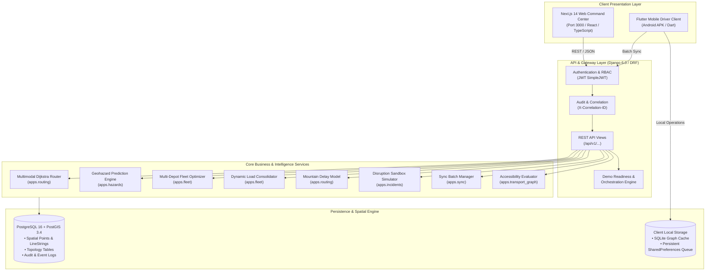

# Architecture Diagram 01: High-Level System Architecture

```mermaid
graph TB
    subgraph ClientLayer ["Client Presentation Layer"]
        NextJS["Next.js 14 Web Command Center<br/>(Port 3000 / React / TypeScript)"]
        Flutter["Flutter Mobile Driver Client<br/>(Android APK / Dart)"]
    end

    subgraph APILayer ["API & Gateway Layer (Django 6.0 / DRF)"]
        AuthMiddleware["Authentication & RBAC<br/>(JWT SimpleJWT)"]
        AuditMiddleware["Audit & Correlation<br/>(X-Correlation-ID)"]
        APIRouters["REST API Views<br/>(/api/v1/...)"]
        DemoOrchestrator["Demo Readiness &<br/>Orchestration Engine"]
    end

    subgraph CoreServices ["Core Business & Intelligence Services"]
        Router["Multimodal Dijkstra Router<br/>(apps.routing)"]
        HazardEngine["Geohazard Prediction Engine<br/>(apps.hazards)"]
        FleetOpt["Multi-Depot Fleet Optimizer<br/>(apps.fleet)"]
        Consolidator["Dynamic Load Consolidator<br/>(apps.fleet)"]
        ETAService["Mountain Delay Model<br/>(apps.routing)"]
        SimEngine["Disruption Sandbox Simulator<br/>(apps.incidents)"]
        SyncManager["Sync Batch Manager<br/>(apps.sync)"]
        AccessEngine["Accessibility Evaluator<br/>(apps.transport_graph)"]
    end

    subgraph DataLayer ["Persistence & Spatial Engine"]
        PostGIS[("PostgreSQL 16 + PostGIS 3.4<br/>• Spatial Points & LineStrings<br/>• Topology Tables<br/>• Audit & Event Logs")]
        LocalCache[("Client Local Storage<br/>• SQLite Graph Cache<br/>• Persistent SharedPreferences Queue")]
    end

    NextJS -->|REST / JSON| AuthMiddleware
    Flutter -->|Batch Sync| AuthMiddleware
    Flutter -->|Local Operations| LocalCache

    AuthMiddleware --> AuditMiddleware
    AuditMiddleware --> APIRouters
    APIRouters --> DemoOrchestrator

    APIRouters --> Router
    APIRouters --> HazardEngine
    APIRouters --> FleetOpt
    APIRouters --> Consolidator
    APIRouters --> ETAService
    APIRouters --> SimEngine
    APIRouters --> SyncManager
    APIRouters --> AccessEngine

    CoreServices --> PostGIS
```
