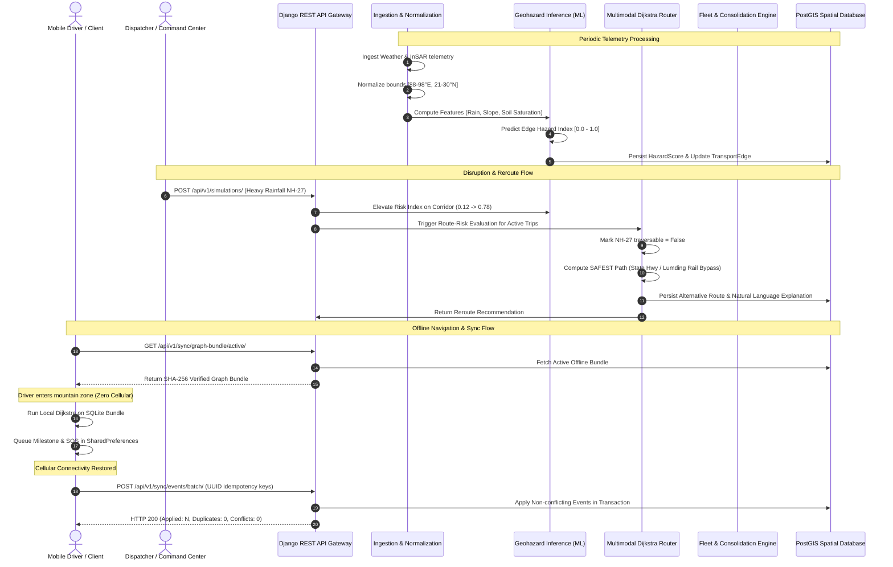

# Architecture Diagram 02: End-to-End Data Flow

```mermaid
sequenceDiagram
    autonumber
    actor Driver as Mobile Driver / Client
    actor Dispatcher as Dispatcher / Command Center
    participant API as Django REST API Gateway
    participant Ingestion as Ingestion & Normalization
    participant Hazard as Geohazard Inference (ML)
    participant Router as Multimodal Dijkstra Router
    participant Optimizer as Fleet & Consolidation Engine
    participant DB as PostGIS Spatial Database

    Note over Ingestion,DB: Periodic Telemetry Processing
    Ingestion->>Ingestion: Ingest Weather & InSAR telemetry
    Ingestion->>Ingestion: Normalize bounds [88-98°E, 21-30°N]
    Ingestion->>Hazard: Compute Features (Rain, Slope, Soil Saturation)
    Hazard->>Hazard: Predict Edge Hazard Index [0.0 - 1.0]
    Hazard->>DB: Persist HazardScore & Update TransportEdge

    Note over Dispatcher,DB: Disruption & Reroute Flow
    Dispatcher->>API: POST /api/v1/simulations/ (Heavy Rainfall NH-27)
    API->>Hazard: Elevate Risk Index on Corridor (0.12 -> 0.78)
    API->>Router: Trigger Route-Risk Evaluation for Active Trips
    Router->>Router: Mark NH-27 traversable = False
    Router->>Router: Compute SAFEST Path (State Hwy / Lumding Rail Bypass)
    Router->>DB: Persist Alternative Route & Natural Language Explanation
    Router->>API: Return Reroute Recommendation

    Note over Driver,DB: Offline Navigation & Sync Flow
    Driver->>API: GET /api/v1/sync/graph-bundle/active/
    API->>DB: Fetch Active Offline Bundle
    API-->>Driver: Return SHA-256 Verified Graph Bundle
    Note over Driver: Driver enters mountain zone (Zero Cellular)
    Driver->>Driver: Run Local Dijkstra on SQLite Bundle
    Driver->>Driver: Queue Milestone & SOS in SharedPreferences
    Note over Driver: Cellular Connectivity Restored
    Driver->>API: POST /api/v1/sync/events/batch/ (UUID idempotency keys)
    API->>DB: Apply Non-conflicting Events in Transaction
    API-->>Driver: HTTP 200 (Applied: N, Duplicates: 0, Conflicts: 0)
```
