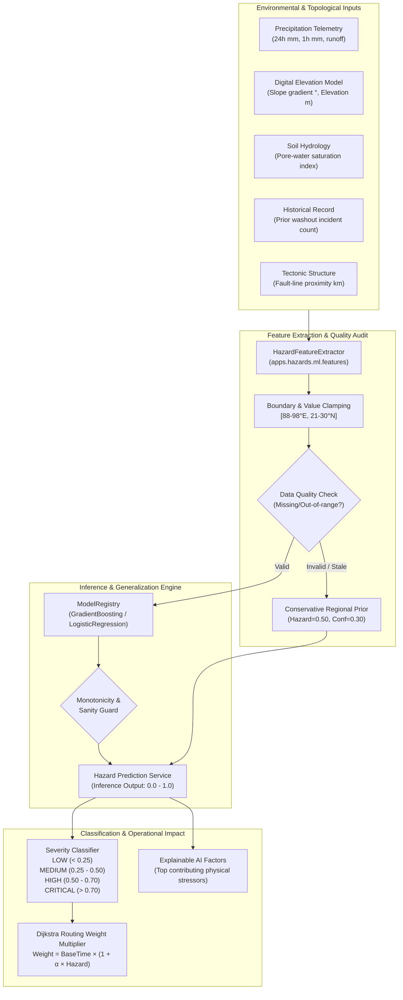

# Architecture Diagram 03: AI/ML Geohazard Intelligence Pipeline

```mermaid
flowchart TD
    subgraph Inputs ["Environmental & Topological Inputs"]
        Rainfall["Precipitation Telemetry<br/>(24h mm, 1h mm, runoff)"]
        DEM["Digital Elevation Model<br/>(Slope gradient °, Elevation m)"]
        Soil["Soil Hydrology<br/>(Pore-water saturation index)"]
        History["Historical Record<br/>(Prior washout incident count)"]
        Faults["Tectonic Structure<br/>(Fault-line proximity km)"]
    end

    subgraph FeatureEngineering ["Feature Extraction & Quality Audit"]
        Extractor["HazardFeatureExtractor<br/>(apps.hazards.ml.features)"]
        Normalizer["Boundary & Value Clamping<br/>[88-98°E, 21-30°N]"]
        AuditCheck{"Data Quality Check<br/>(Missing/Out-of-range?)"}
        FallbackPrior["Conservative Regional Prior<br/>(Hazard=0.50, Conf=0.30)"]
    end

    subgraph ModelInference ["Inference & Generalization Engine"]
        Registry["ModelRegistry<br/>(GradientBoosting / LogisticRegression)"]
        SanityGuard{"Monotonicity &<br/>Sanity Guard"}
        Predictor["Hazard Prediction Service<br/>(Inference Output: 0.0 - 1.0)"]
    end

    subgraph OutputLayer ["Classification & Operational Impact"]
        Severity["Severity Classifier<br/>LOW (< 0.25)<br/>MEDIUM (0.25 - 0.50)<br/>HIGH (0.50 - 0.70)<br/>CRITICAL (> 0.70)"]
        Explainability["Explainable AI Factors<br/>(Top contributing physical stressors)"]
        RoutingEngine["Dijkstra Routing Weight Multiplier<br/>Weight = BaseTime × (1 + α × Hazard)"]
    end

    Inputs --> Extractor
    Extractor --> Normalizer
    Normalizer --> AuditCheck

    AuditCheck -- Invalid / Stale --> FallbackPrior
    AuditCheck -- Valid --> Registry

    Registry --> SanityGuard
    SanityGuard --> Predictor
    FallbackPrior --> Predictor

    Predictor --> Severity
    Predictor --> Explainability
    Severity --> RoutingEngine
```
