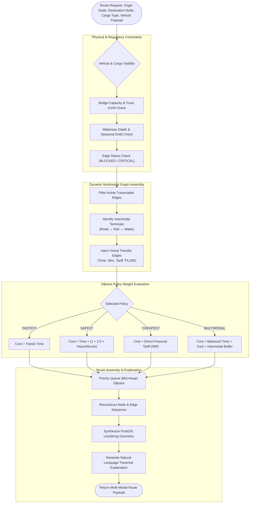

# Architecture Diagram 04: Multimodal Routing & Policy Selection Flow

```mermaid
flowchart TD
    Start([Route Request: Origin Node, Destination Node, Cargo Type, Vehicle Payload]) --> ConstraintsCheck

    subgraph Constraints ["Physical & Regulatory Constraints"]
        ConstraintsCheck{"Vehicle & Cargo Viability"}
        WeightCheck["Bridge Capacity & Truck GVW Check"]
        WaterDraft["Waterway Depth & Seasonal Draft Check"]
        PassableCheck["Edge Status Check (BLOCKED / CRITICAL)"]
    end

    ConstraintsCheck --> WeightCheck
    WeightCheck --> WaterDraft
    WaterDraft --> PassableCheck

    subgraph GraphBuilding ["Dynamic Multimodal Graph Assembly"]
        PassableCheck --> FetchActiveEdges["Filter Active Traversable Edges"]
        FetchActiveEdges --> IntermodalNodes["Identify Intermodal Terminals<br/>(Road ↔ Rail ↔ Water)"]
        IntermodalNodes --> AddTransferEdges["Inject Virtual Transfer Edges<br/>(Time: 30m, Tariff: ₹4,200)"]
    end

    subgraph PolicyExecution ["Dijkstra Policy Weight Evaluation"]
        AddTransferEdges --> PolicySelect{"Selected Policy"}
        PolicySelect -- FASTEST --> FastWeight["Cost = Transit Time"]
        PolicySelect -- SAFEST --> SafeWeight["Cost = Time × (1 + 2.5 × HazardScore)"]
        PolicySelect -- CHEAPEST --> CheapWeight["Cost = Direct Financial Tariff (INR)"]
        PolicySelect -- MULTIMODAL --> MultiWeight["Cost = Balanced Time + Cost + Intermodal Buffer"]
    end

    FastWeight --> PriorityQueue["Priority Queue (Min-Heap) Dijkstra"]
    SafeWeight --> PriorityQueue
    CheapWeight --> PriorityQueue
    MultiWeight --> PriorityQueue

    subgraph RouteSynthesis ["Route Assembly & Explanation"]
        PriorityQueue --> PathReconstruction["Reconstruct Node & Edge Sequence"]
        PathReconstruction --> PostGISLineString["Synthesize PostGIS LineString Geometry"]
        PostGISLineString --> ExplainEngine["Generate Natural Language Traversal Explanation"]
        ExplainEngine --> FinalRoute([Return Multi-Modal Route Payload])
    end
```
