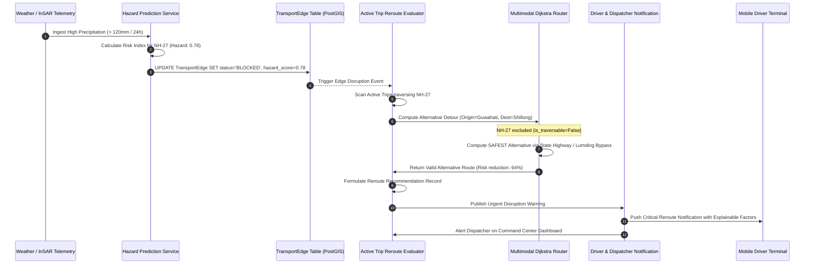

# Architecture Diagram 05: Hazard Detection & Automated Dynamic Reroute Flow

```mermaid
sequenceDiagram
    autonumber
    participant Sensor as Weather / InSAR Telemetry
    participant HazardService as Hazard Prediction Service
    participant EdgeModel as TransportEdge Table (PostGIS)
    participant Monitor as Active Trip Reroute Evaluator
    participant Router as Multimodal Dijkstra Router
    participant Notif as Driver & Dispatcher Notification
    participant DriverUI as Mobile Driver Terminal

    Sensor->>HazardService: Ingest High Precipitation (> 120mm / 24h)
    HazardService->>HazardService: Calculate Risk Index for NH-27 (Hazard: 0.78)
    HazardService->>EdgeModel: UPDATE TransportEdge SET status='BLOCKED', hazard_score=0.78
    EdgeModel-->>Monitor: Trigger Edge Disruption Event

    Monitor->>Monitor: Scan Active Trips traversing NH-27
    Monitor->>Router: Compute Alternative Detour (Origin=Guwahati, Dest=Shillong)
    
    Note over Router: NH-27 excluded (is_traversable=False)
    Router->>Router: Compute SAFEST Alternative via State Highway / Lumding Bypass
    Router->>Monitor: Return Valid Alternative Route (Risk reduction: 64%)

    Monitor->>Monitor: Formulate Reroute Recommendation Record
    Monitor->>Notif: Publish Urgent Disruption Warning
    Notif->>DriverUI: Push Critical Reroute Notification with Explainable Factors
    Notif->>Monitor: Alert Dispatcher on Command Center Dashboard
```
