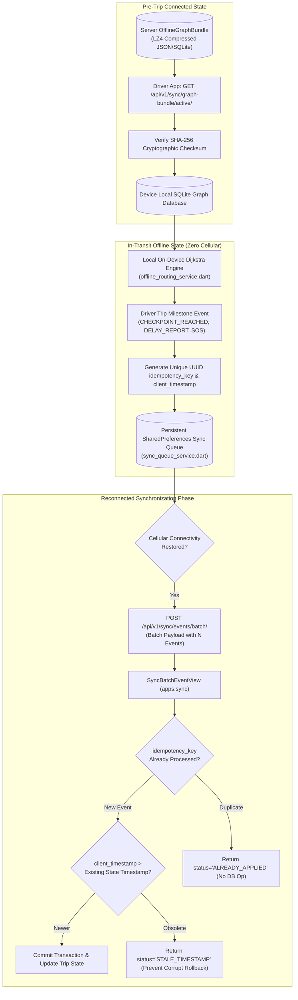

# Architecture Diagram 06: Offline-First Synchronization & Conflict Resolution

```mermaid
flowchart TD
    subgraph OnlinePhase ["Pre-Trip Connected State"]
        ServerBundle[("Server OfflineGraphBundle<br/>(LZ4 Compressed JSON/SQLite)")]
        FetchBundle["Driver App: GET /api/v1/sync/graph-bundle/active/"]
        VerifySHA["Verify SHA-256 Cryptographic Checksum"]
        LocalCache[("Device Local SQLite Graph Database")]
        ServerBundle --> FetchBundle --> VerifySHA --> LocalCache
    end

    subgraph DisconnectedPhase ["In-Transit Offline State (Zero Cellular)"]
        LocalRouting["Local On-Device Dijkstra Engine<br/>(offline_routing_service.dart)"]
        MilestoneEvent["Driver Trip Milestone Event<br/>(CHECKPOINT_REACHED, DELAY_REPORT, SOS)"]
        UUIDGen["Generate Unique UUID idempotency_key & client_timestamp"]
        SyncQueue[("Persistent SharedPreferences Sync Queue<br/>(sync_queue_service.dart)")]
        
        LocalCache --> LocalRouting
        LocalRouting --> MilestoneEvent --> UUIDGen --> SyncQueue
    end

    subgraph SyncRecoveryPhase ["Reconnected Synchronization Phase"]
        NetworkDetect{"Cellular Connectivity<br/>Restored?"}
        BatchPost["POST /api/v1/sync/events/batch/<br/>(Batch Payload with N Events)"]
        ServerReceiver["SyncBatchEventView (apps.sync)"]
        IdempotencyCheck{"idempotency_key<br/>Already Processed?"}
        TimestampCheck{"client_timestamp ><br/>Existing State Timestamp?"}
        ApplyEvent["Commit Transaction & Update Trip State"]
        DropDuplicate["Return status='ALREADY_APPLIED' (No DB Op)"]
        DropStale["Return status='STALE_TIMESTAMP' (Prevent Corrupt Rollback)"]
        
        SyncQueue --> NetworkDetect
        NetworkDetect -- Yes --> BatchPost
        BatchPost --> ServerReceiver
        ServerReceiver --> IdempotencyCheck
        IdempotencyCheck -- Duplicate --> DropDuplicate
        IdempotencyCheck -- New Event --> TimestampCheck
        TimestampCheck -- Newer --> ApplyEvent
        TimestampCheck -- Obsolete --> DropStale
    end
```
