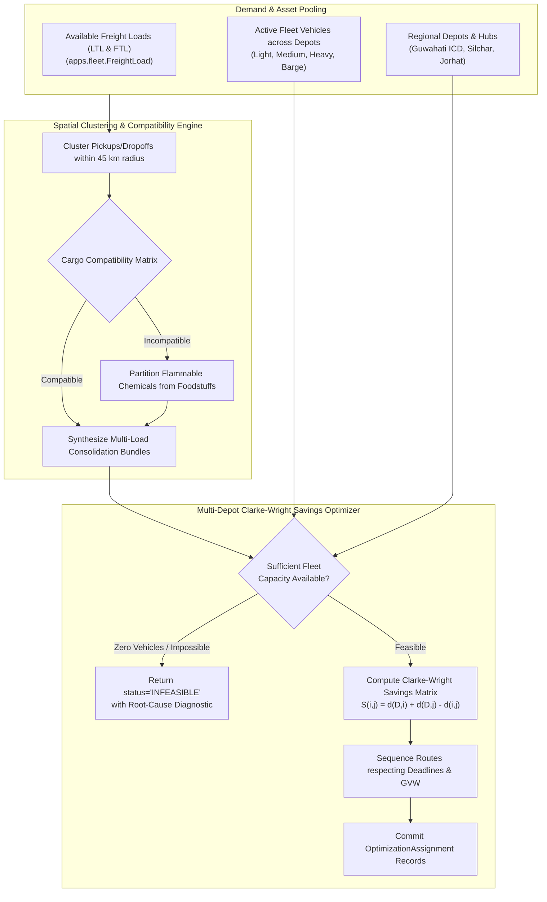

# Architecture Diagram 07: Multi-Depot Fleet Optimization & Dynamic Consolidation

```mermaid
flowchart TD
    subgraph Inputs ["Demand & Asset Pooling"]
        Loads["Available Freight Loads (LTL & FTL)<br/>(apps.fleet.FreightLoad)"]
        Vehicles["Active Fleet Vehicles across Depots<br/>(Light, Medium, Heavy, Barge)"]
        Depots["Regional Depots & Hubs<br/>(Guwahati ICD, Silchar, Jorhat)"]
    end

    subgraph DynamicConsolidation ["Spatial Clustering & Compatibility Engine"]
        HaversineCluster["Cluster Pickups/Dropoffs within 45 km radius"]
        CompatCheck{"Cargo Compatibility Matrix"}
        SeparateHaz["Partition Flammable Chemicals from Foodstuffs"]
        BundleCreate["Synthesize Multi-Load Consolidation Bundles"]
    end

    Inputs --> HaversineCluster
    HaversineCluster --> CompatCheck
    CompatCheck -- Incompatible --> SeparateHaz
    CompatCheck -- Compatible --> BundleCreate
    SeparateHaz --> BundleCreate

    subgraph DispatchOptimizer ["Multi-Depot Clarke-Wright Savings Optimizer"]
        FeasibilityGate{"Sufficient Fleet<br/>Capacity Available?"}
        InfeasibleReport["Return status='INFEASIBLE'<br/>with Root-Cause Diagnostic"]
        SavingsMatrix["Compute Clarke-Wright Savings Matrix<br/>S(i,j) = d(D,i) + d(D,j) - d(i,j)"]
        RouteSequencer["Sequence Routes respecting Deadlines & GVW"]
        AssignmentCommit["Commit OptimizationAssignment Records"]
    end

    BundleCreate --> FeasibilityGate
    Vehicles --> FeasibilityGate
    Depots --> FeasibilityGate

    FeasibilityGate -- Zero Vehicles / Impossible --> InfeasibleReport
    FeasibilityGate -- Feasible --> SavingsMatrix
    SavingsMatrix --> RouteSequencer
    RouteSequencer --> AssignmentCommit
```
