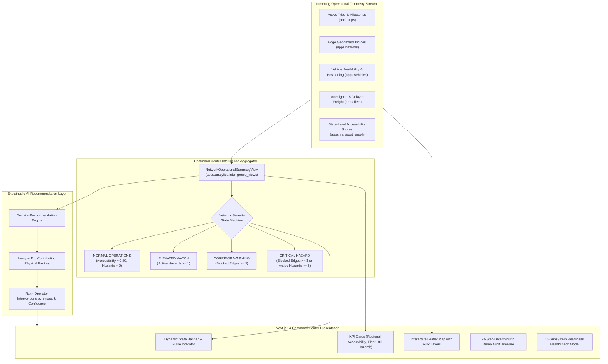

# Architecture Diagram 08: Command Center Operational Intelligence Architecture

```mermaid
flowchart TD
    subgraph OperationalStreams ["Incoming Operational Telemetry Streams"]
        TripsFeed["Active Trips & Milestones (apps.trips)"]
        HazardFeed["Edge Geohazard Indices (apps.hazards)"]
        FleetFeed["Vehicle Availability & Positioning (apps.vehicles)"]
        CargoFeed["Unassigned & Delayed Freight (apps.fleet)"]
        AccessFeed["State-Level Accessibility Scores (apps.transport_graph)"]
    end

    subgraph AnalyticsEngine ["Command Center Intelligence Aggregator"]
        SummaryView["NetworkOperationalSummaryView<br/>(apps.analytics.intelligence_views)"]
        SeveritySM{"Network Severity<br/>State Machine"}
        StateNormal["NORMAL OPERATIONS<br/>(Accessibility > 0.80, Hazards = 0)"]
        StateWatch["ELEVATED WATCH<br/>(Active Hazards >= 1)"]
        StateWarning["CORRIDOR WARNING<br/>(Blocked Edges >= 1)"]
        StateCritical["CRITICAL HAZARD<br/>(Blocked Edges >= 3 or Active Hazards >= 8)"]
        
        SummaryView --> SeveritySM
        SeveritySM --> StateNormal
        SeveritySM --> StateWatch
        SeveritySM --> StateWarning
        SeveritySM --> StateCritical
    end

    OperationalStreams --> SummaryView

    subgraph ExplainableAI ["Explainable AI Recommendation Layer"]
        RecEngine["DecisionRecommendation Engine"]
        TopFactors["Analyze Top Contributing Physical Factors"]
        RankInterventions["Rank Operator Interventions by Impact & Confidence"]
    end

    SummaryView --> RecEngine --> TopFactors --> RankInterventions

    subgraph UICommandCenter ["Next.js 14 Command Center Presentation"]
        Banner["Dynamic State Banner & Pulse Indicator"]
        KPICards["KPI Cards (Regional Accessibility, Fleet Util, Hazards)"]
        MapDisplay["Interactive Leaflet Map with Risk Layers"]
        ActionTimeline["24-Step Deterministic Demo Audit Timeline"]
        ReadinessModal["15-Subsystem Readiness Healthcheck Modal"]
    end

    RankInterventions --> UICommandCenter
    SeveritySM --> Banner
    SummaryView --> KPICards
    OperationalStreams --> MapDisplay
```
